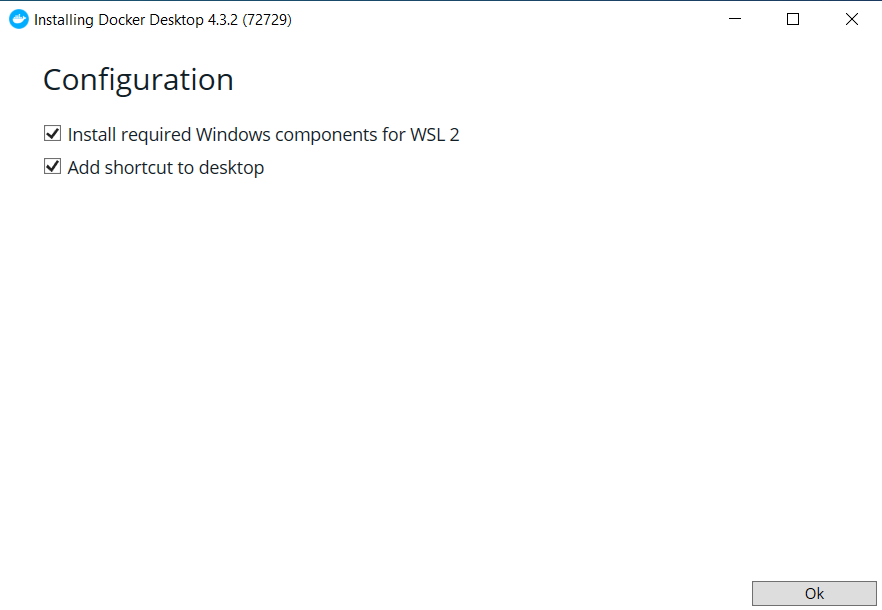
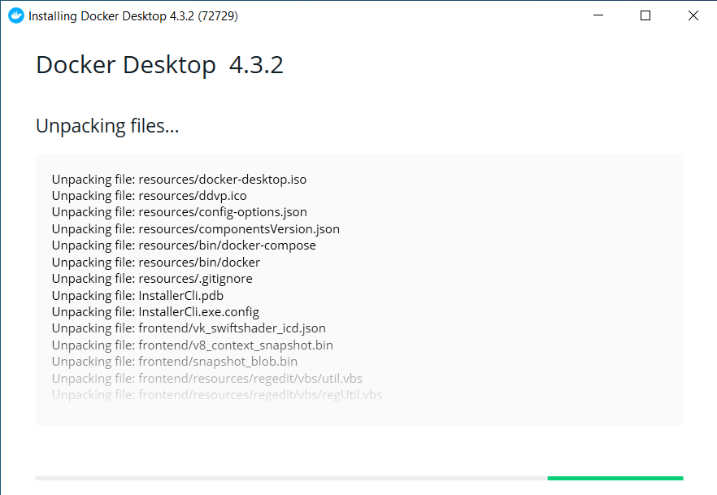
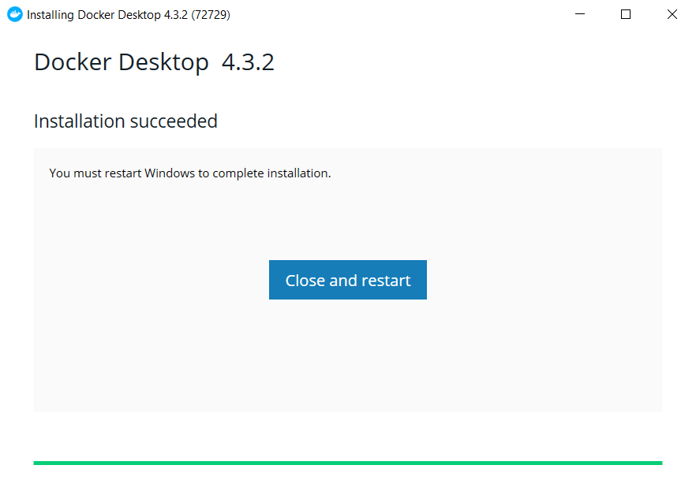
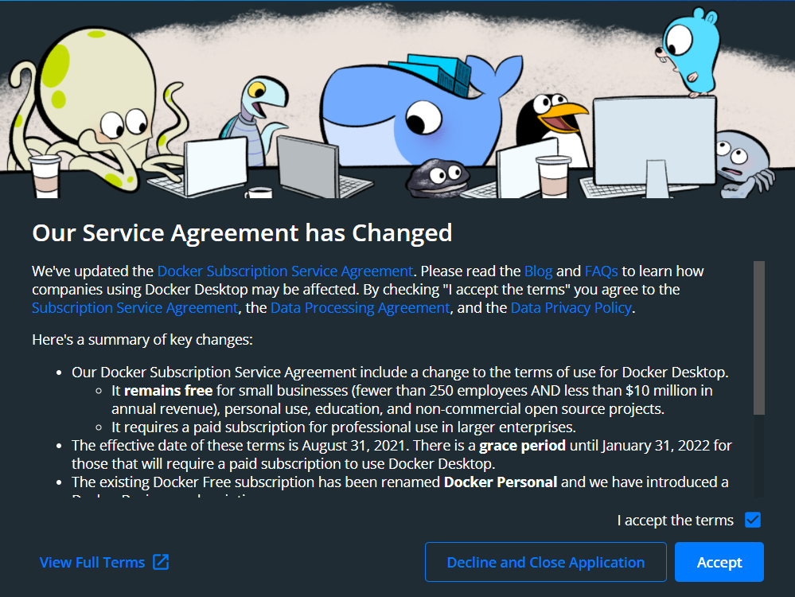
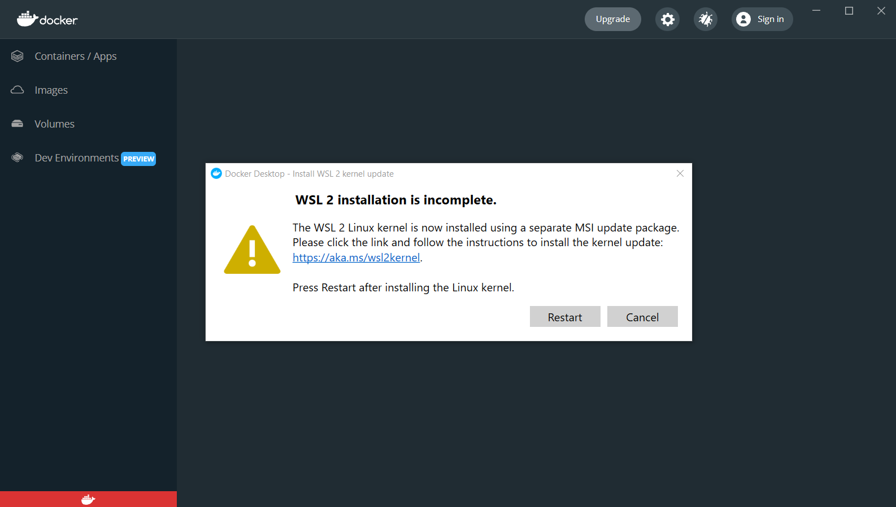
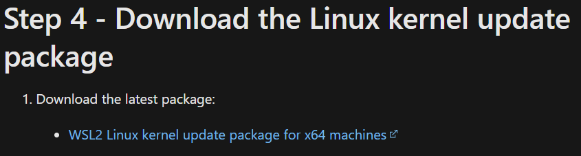
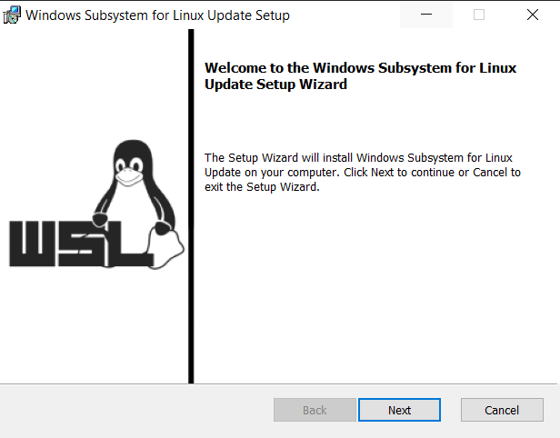
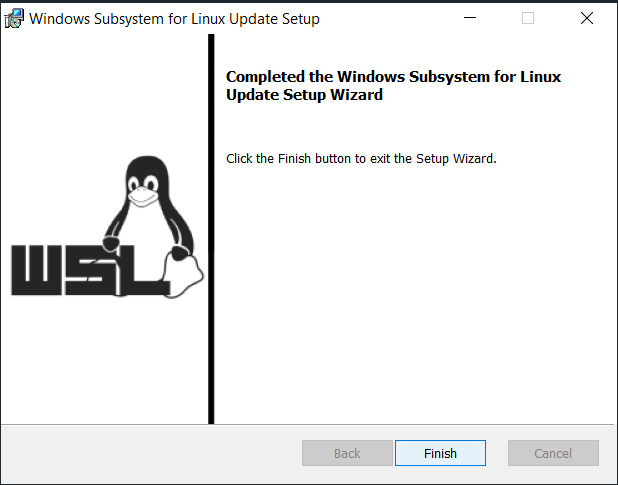

# Chương 2: Cài đặt Docker Desktop

Bài này chỉ hướng dẫn cài đặt cho Hệ điều hành Windows. Các hệ điều hành khác có thể tham khảo thêm tại [Docker Desktop](https://docs.docker.com/desktop/).

## Table of Contents
- [1. Docker Desktop là gì?](#1-docker-desktop-là-gì)
- [2. Một số tính năng chính của Docker Desktop](#2-một-số-tính-năng-chính-của-docker-desktop)
- [3. Tải và cài đặt Docker Desktop](#3-tải-và-cài-đặt-docker-desktop)
- [Reference](#reference)

## 1. Docker Desktop là gì?
Docker Desktop là một ứng dụng cho phép bạn xây dựng và chia sẻ các ứng dụng thông qua các thùng chứa (Container)

Docker Desktop bao gồm [Docker Engine](https://docs.docker.com/engine/), Docker CLI client, [Docker Compose](https://docs.docker.com/compose/), [Docker Content Trust](https://docs.docker.com/engine/security/trust/), [Kubernetes](https://github.com/kubernetes/kubernetes/), và [Credential Helper](https://github.com/docker/docker-credential-helpers/)

Docker Desktop hoạt động với sự lựa chọn của bạn về các công cụ và ngôn ngữ phát triển, đồng thời cung cấp cho bạn quyền được truy cập vào một thư viện rộng lớn gồm các images và templates trong [Docker Hub](https://hub.docker.com/)

## 2. Một số tính năng chính của Docker Desktop
- Khả năng chứa và chia sẻ bất kì ứng dụng nào trên bất kì nền tảng đám mây nào, bằng nhiều ngôn ngữ và frameworks
- Dễ dàng cài đặt và thiết lập một môi trường phát triển Docker hoàn chỉnh
- Bao gồm phiên bản mới nhất của Kubernetes
- Cập nhật tự động để giúp bạn luôn cập nhật và bảo mật
- Trên Windows, khả năng chuyển đổi giữa các môi trường Linux và Windows Server để xây dựng các ứng dụng
- Hiệu suất nhanh và đáng tin cậy với Windows Hyper-V virtualization
- Khả năng làm việc trên Linux thông qua WSL 2 trên Windows
- Chứa lượng lớn code và dữ liệu, bao gồm thông báo thay đổi tệp và dễ dàng truy cập vào các vùng chứa đang chạy trên localhost network
- In-container development and debugging với các IDE được hỗ trợ

## 3. Tải và cài đặt Docker Desktop

### Tải Docker Desktop
Để tải Docker Destop, truy cập đường dẫn https://docs.docker.com/desktop/windows/install/, tìm và cài đặt Docker Desktop phù hợp với hệ điều hành của máy bạn. Bài hướng dẫn dưới đây dành cho hệ điều hành Windows

### Cài đặt Docker Desktop
- Tìm và chạy file `Docker Desktop Installer.exe` đã tải về ở trên
- Màn hình hiện các thiết lập cho việc cài đặt, **nhấn chọn tất cả**, sau đó chọn **OK** để bắt đầu quá trình cài đặt
  
- Lúc này Docker Desktop sẽ tự động được cài đặt vào máy của bạn
  
- Sau khi quá trình cài đặt hoàn tất, Docker Desktop sẽ yêu cầu restart máy của bạn, chọn **Close and restart**
  
- Sau khi máy tính được khởi động, Docker Desktop sẽ tự động được mở trở lại, và bạn cần chấp nhận các quy định của Docker Desktop. Nhấn chọn vào **I accept the terms" và sau đó chọn nút **Accept**
  
- Tuy nhiên lúc này sẽ xuất hiện lỗi do máy bạn chưa được cài đặt [WSL2](https://docs.microsoft.com/en-us/windows/wsl/about). Truy cập đường dẫn https://aka.ms/wsl2kernel để thực hiện cài đặt
  
- Bấm vào **WSL2 Linux kernel update package for x64 machines** để tải WSL2 về máy
  
- Sau khi đã tải về máy, tìm và chạy file `wsl_update_x64.msi` đề cài đặt, nhấn **Next** để tiếp tục
  
- Sau khi hoàn tất cài đặt WSL2, nhấn **Finish** để hoàn tất
  

## Reference
- [Install Docker Desktop on Windows](https://docs.docker.com/desktop/windows/install/)
- [Docker Desktop overview](https://docs.docker.com/desktop/)

