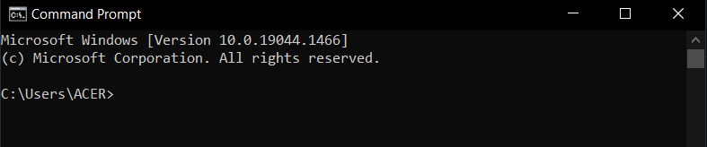
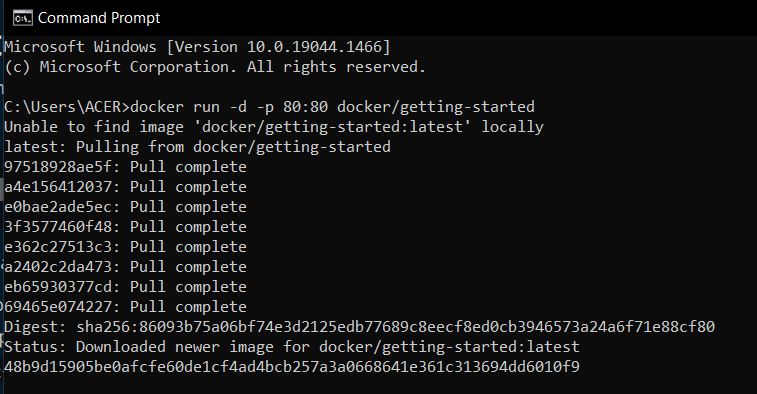
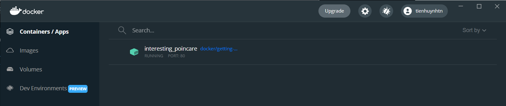
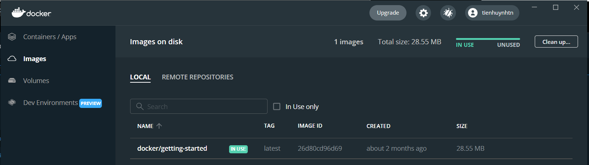

# Chương 3: Chạy ứng dụng đầu tiên bằng Docker - Run your first application with Docker

## Table of Contents
- [Bắt đầu bài hướng dẫn](#bắt-đầu-bài-hướng-dẫn)
- [The Docker Dashboard](#the-docker-dashboard)
- [Container là gì?](#container-là-gì)
- [Container image là gì?](#container-image-là-gì)
- [Reference](#reference)
- [License & Copyright](#license--copyright)

## Bắt đầu bài hướng dẫn
- Khởi động Docker Desktop trên máy của bạn. Nếu bạn không khởi động Docker Desktop ở bước này sẽ làm những bước chạy tiếp theo gây lỗi
- Mở command prompt (cmd)
  
- Chạy câu lệnh
`docker run -d -p 80:80 docker/getting-started`
- Màn hình sẽ xuất hiện như thế này
  
- Giải thích
  - `-d` - detached - chạy ngầm container dưới windows mà chúng ta không thể thấy được
  - `-p 80:80` - port - ánh xạ cổng 80 của máy chúng ta tới cổng 80 trong container
  - `docker/getting-started` - tên của image sẽ sử dụng
  - `Unable to find image 'docker/getting-started:lastest' locally` - Không thể tìm thấy image này do chúng ta chưa từng tải image này về
  - `lastest` - version của image
- Câu lệnh dạng ngắn gọn hơn của câu lệnh trên `docker run -dp 80:80 docker/getting-started`

## The Docker Dashboard
- Sau khi đã chạy câu lệnh trên, bạn hãy mở Docker Desktop. Lúc này tại phần `Containers/Apps` sẽ xuất hiện một ứng dụng là `interesting_poincare` đang được chạy
  
- Từ `interesting_poincare`là một tên được tạo ngẫu nhiên nên trên mỗi máy sẽ có sự khác nhau
- Ứng dụng này của bạn đang được chạy trên port 80 của máy tính
- Kiểm tra ứng dụng có thực sự chạy bằng cách mở trình duyệt của máy, gõ `localhost:80`, thì sẽ hiện ra trang web Getting Started của Docker là thành công
- Và để xem các image đã được tải về khi nãy, tại Docker Desktop, bạn chọn phần Images và sẽ thấy thông tin các image đã tải về. Ở vd này là image docker/getting-startted:latest
  

## Container là gì?
Như vậy bạn đã hoàn tất việc chạy 1 container, vậy container là gì? Nói một cách đơn giản, 1 container như là 1 cái hộp, ứng dụng, được chạy trên máy của bạn và chạy độc lập với các tiến trình khác trên máy tính của bạn

Tổng kết, 1 container là:
- 1 instance (thể hiện) chạy được của 1 image. Bạn có thể tạo, bắt đầu, dừng, di chuyển, xóa 1 container bằng cách sử dụng DockerAPI hoặc CLI
- Có thể chạy trên máy cục bộ, máy ảo hoặc triển khai chúng trên cloud
- Có thể chạy trên bất cứ hệ điều hành nào
- Nó được chạy độc lập và chạy phần mềm và các cấu hình của nó

Docker container là một run-time environment mà ở đó người dùng có thể chạy một ứng dụng độc lập. Những container này rất gọn nhẹ và cho phép bạn chạy ứng dụng trong đó rất nhanh chóng và dễ dàng.

## Container image là gì?
- Khi chạy 1 container, nó sử dụng 1 hệ thống tệp riêng biệt. 
- Hệ thống tệp riêng biệt này được cung cấp bởi 1 container image
- Vì image chứa hệ thống tệp của container, nó phải chưa mọi thứ cần thiết để chạy một ứng dụng (dependencies, configuration, scripts, binaries, etc)
- Image cũng chứa cấu hình khác cho vùng chứ, chẳng hạn như biến môi trường, lệnh mặc định để chạy và siêu dữ liệu khác

Hay nói đơn giản, Docker image là một file bất biến - không thay đổi, chứa các source code, libraries, dependencies, tools và các files khác cần thiết cho một ứng dụng để chạy.

## Reference
- [Docker Documentation](https://docs.docker.com/get-started/)
- [Phân biệt Docker image vs Container](https://viblo.asia/p/phan-biet-docker-image-vs-container-bJzKmz4wZ9N)

## License & Copyright
&copy; 2022 Tien Huynh tienhuynh-tn Licensed under the [MIT LICENSE](https://github.com/tienhuynh-tn/docker-basic-tutorial/blob/main/LICENSE).

> :love_you_gesture: Feel free to use my repository and star it if you find something interesting :love_you_gesture:

