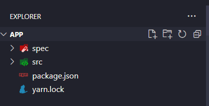
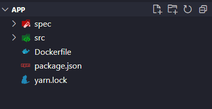
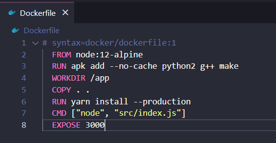
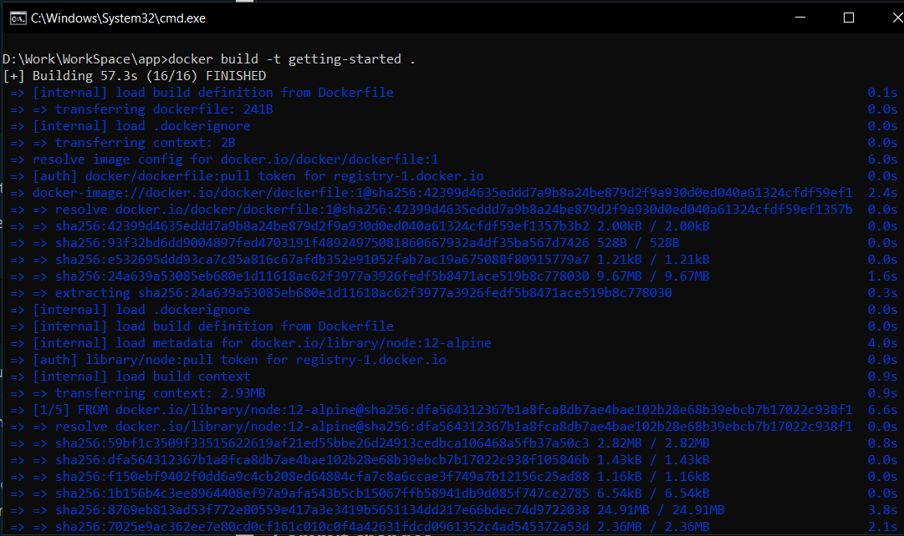
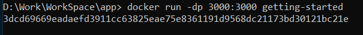
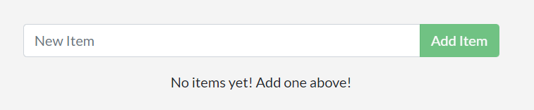

# Chương 3: Ứng dụng mẫu - Sample application

Tại phần hướng dẫn này, chúng ta sẽ làm việc với một ứng dụng quản lý những công việc cần làm - todo list đơn giản. Ứng dụng này được chayj bằng Node.js. Nếu bạn không quen với Node.js, đừng lo lắng. Không cần kinh nghiệm về Javascript mà vẫn có thể hoàn thành bài hướng dẫn.

Tại thời điểm này, nhóm phát triển phần mềm của bạn khá nhỏ và bạn chỉ đơn giản là xây dựng một ứng dụng để chứng minh MVP của bạn (MVP - minimum viable product - sản phẩm khả dụng). Bạn muốn thể hiện cách làm thế nào nó hoạt động và những gì nó có khả năng làm mà không cần phải suy nghĩ về cách nó sẽ hoạt động trong một nhóm lớn, nhiều nhà phát triển,...

## Table of Contents
- [Get the app - Tải app](#get-the-app---tải-app)
- [Build the app’s container image - Xây dựng container image của app](#build-the-apps-container-image---xây-dựng-container-image-của-app)
- [Start an app container - Chạy ứng dụng](#start-an-app-container---chạy-ứng-dụng)
- [Recap - Tổng kết](#recap----tổng-kết)
- [Reference](#reference)
- [License & Copyright](#license--copyright)

## Get the app - Tải app

Trước khi chúng ta chạy ứng dụng, chúng ta cần tải source code của ứng dụng về máy. Với dự án thật, bạn thường clone repo. Nhưng, với bài hướng dẫn này, chúng ta đã có một file zip chứa toàn bộ ứng dụng
1. [Download the App contents - Tải app](https://github.com/docker/getting-started/tree/master/app). Bạn có thể kéo toàn bộ dự án về hoặc tải nó như là file zip và giải nén thư mục chứa app để bắt đầu.
  - Truy cập [DownGit](https://downgit.github.io/#/home)
  - Dán đường dẫn `https://github.com/docker/getting-started/tree/master/app` vào khung text 
  - Nhấn nút Download để thực hiện download thư mục
  - Tham khảo các cách download thư mục của một repository GitHub tại [Download a single folder or directory from a GitHub repo](https://stackoverflow.com/questions/7106012/download-a-single-folder-or-directory-from-a-github-repo)
2. Giải nén thư mục `app.zip`, sử dụng trình soạn thảo code yêu thích của bạn để mở dự án lên. Bạn có thể dùng Visual Studio Code. Bạn sẽ thấy file `package.json` và 2 thư mục nhỏ là `src` và `spec`



## Build the app’s container image - Xây dựng container image của app

Để build ứng dựng, chúng ta cần sử dụng `Dockerfile`. 

Dockerfile chỉ đơn giản là một tập lệnh dựa trên văn bản của các hướng dẫn được sử dụng để tạo 1 container image. Hãy cùng bắt đầu tạo Dockerfile

1. Tạo một file được đặt tên là `Dockerfile` trong cùng thư mục với file `package.json` với các nội dung như sau:


 
  ```
  # syntax=docker/dockerfile:1
  FROM node:12-alpine
  RUN apk add --no-cache python2 g++ make
  WORKDIR /app
  COPY . .
  RUN yarn install --production
  CMD ["node", "src/index.js"]
  EXPOSE 3000
  ```
  


Vui lòng kiểm tra thật kỹ rằng `Dockerfile` không có phần mở rộng file như là `.txt`. Một vài code editor có thể tự động thêm phần mở rộng của file và điều này sẽ gây ra lỗi ở các bước kế tiếp.

2. Tiếp theo, mở terminal (cmd) và đi đến thư mục `app` với `Dockerfile`. Bây giờ thực hiện build container image sử dụng câu lệnh `docker build`
```
docker build -t getting-started .
```


- Dòng lệnh trên sử dụng Dockerfile để build một container image mới. Bạn sẽ thấy có rất nhiều "layers" được tải xuống. Điều này bới vì dòng hướng dẫn mà chúng ta muốn bắt đầu từ `node:12-alpine` trong Dockerfile
- Sau khi image được tải xuống, chúng ta sao chép vào trong ứng dụng và sử dụng `yarn` để cài đặt các dependencies của ứng dụng.
- Cuối cùng, `-t` như là thẻ cho image. Nghĩ đơn giản giống như tên người có thể đọc được cho final image. Chúng ta đặt tên cho image là `getting-started`, chúng ta có thể tham chiếu đến image khi chạy container
- Dấu `.` cuối cùng của câu lệnh nói rằng Docker nên tìm kiếm Dockerfile trong thư mục hiện tại

## Start an app container - Chạy ứng dụng

Bây giờ chúng ta đã có 1 image, hãy bắt đầu chạy ứng dụng. Để làm được điều đó, chúng ta sử dụng `docker run`
1. Sử dụng câu lệnh dưới đây cùng với tên của image mà chúng ta đã tạo
```
docker run -dp 3000:3000 getting-started
```


2. Sau vài giây, mở trình duyệt của bạn tại địa chỉ [](http://localhost:300). Bạn sẽ thấy app của bạn.



3. Hãy tiếp tục thêm vài todo list và thấy rằng ứng dụng hoạt động như bạn mong đợi. Bạn có thể đánh dấu các mục đã hoàn thành và xóa các mục.

## Recap  - Tổng kết
Trong phần hướng dẫn này, chúng ta đã tìm hiểu những kiến thức cơ bản về xây dựng container image và tạo Dockerfile. Sau khi tạo image, chúng ta đã khởi động container và thấy ứng dụng chạy.

Tiếp theo, chúng ta sẽ thực hiện một sửa đổi đối với ứng dụng và tìm hiểu cách cập nhật ứng dụng đang chạy với một image mới. Và chúng ta cũng sẽ tìm hiểu một số lệnh hữu ích khác. Hãy cùng đón chờ các bài hướng dẫn kế tiếp.

## Reference
- [Docker Documentation](https://docs.docker.com/get-started/)
- [Get started - Part 2: Sample application](https://docs.docker.com/get-started/02_our_app/)

## License & Copyright
&copy; 2022 Tien Huynh tienhuynh-tn Licensed under the [MIT LICENSE](https://github.com/tienhuynh-tn/docker-basic-tutorial/blob/main/LICENSE).

> :love_you_gesture: Feel free to use my repository and star it if you find something interesting :love_you_gesture:

