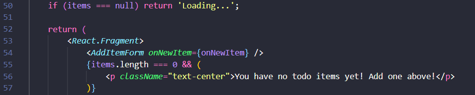

# Chương 5: Cập nhật ứng dụng - Update the application

Theo một yêu cầu tính năng nhỏ, chúng ta được yêu cầu bởi nhóm sản phẩm để thay đổi "empty text" khi chúng ta không có bất kì mục nào trong danh sách việc cần làm. Nó sẽ thay đổi như sau:

Ban đầu:


Sau khi thay đổi:


## Table of Contents
- [Update the source code - Cập nhật mã nguồn](#update-the-source-code---cập-nhật-mã-nguồn)
- [Replace the old container - Thay thế container cũ](#replace-the-old-container---thay-thế-container-cũ)
  - [Remove a container using the CLI - Hủy một container sử dụng CLI](#remove-a-container-using-the-CLI---hủy-một-container-sử-dụng-CLI)
  - [Remove a container using the Docker Dashboard - Hủy một container sử dụng Docker Dashboard](#remove-a-container-using-the-docker-daskboard---hủy-một-container-sử-dụng-docker-dashboard)
  - [Start the updated app container - Khởi động container đã được cập nhật của ứng dụng](#start-the-updated-app-container---khởi-động-container-đã-được-cập-nhật-của-ứng-dụng)
- [Recap - Tổng kết](#recap----tổng-kết)
- [Reference](#reference)
- [License & Copyright](#license--copyright)

## Update the source code - Cập nhật mã nguồn

1. Trong `src/static/js/app.js` file, cập nhật dòng thứ 56 như sau:
```
<p className="text-center">You have no todo items yet! Add one above!</p>
```




2. Hãy build phiên bản cập nhật của image, sử dụng câu lệnh giống như kỳ trước chúng ta đã sử dụng
```
docker build -t getting-started .
```


3. Hãy khởi động một container mới sử dụng dòng code đã được cập nhật
```
docker run -dp 3000:3000 getting-started
```


Bạn sẽ thấy một lỗi như hình ở trên. Vậy điều gì đã xảy ra? Chúng ta không thể khởi động container mới bởi vì container cũ của chúng ta vẫn đang chạy. Nó bởi vì container sử dụng port 3000 và chỉ có 1 tiến trình trên máy có thể lắng nghe đến port đó. Để khắc phục lỗi, chúng ta cần phải xóa bỏ (hủy) container cũ.

## Replace the old container - Thay thế container cũ

Để loại bỏ một container, đầu tiên nó cần được dừng lại. Chỉ khi nó được dừng lại, nó mới có thể bị loại bỏ. Chúng ta có 2 cách để loại bỏ container cũ. Hãy chọn cách mà bạn thích và cảm thấy thoải mái nhất.

### Remove a container using the CLI - Hủy một container sử dụng CLI

1. Lấy ID của container sử dụng câu lệnh `docker ps`
```
docker ps
```


2. Sử dụng `docker stop` để dừng container
Thêm vào ID của container ở bước 1 để dừng đúng container
```
docker stop <the-container-id>
```


3. Khi container đã dừng, bạn có thể loại bỏ nó bằng cách sử dụng lệnh `docker rm`
```
docker rm <the-container-id>
```


**Note**
Bạn có thể dừng và loại bỏ container chỉ bằng một câu lệnh duy nhất bằng cách thêm "force" -f vào câu lệnh `docker rm`
```
docker rm -f <the-container-id>
```

### Remove a container using the Docker Dashboard - Hủy một container sử dụng Docker Dashboard

Nếu bạn sử dụng Docker Dashboard, bạn có thể loại bỏ một container chỉ với 2 cú nhấp chuột. Điều này sẽ dễ dàng hơn việc tìm kiếm container ID và thực hiện loại bỏ nó.

Điều bạn cần thực hiện là tìm kiếm container mà bạn muốn loại bỏ, nhấn vào biếu tượng Xóa và xác nhận xóa container là đã hoàn thành việc loại bỏ container.


### Start the updated app container - Khởi động container đã được cập nhật của ứng dụng

1. Khởi động ứng dụng đã được cập nhật của bạn bằng câu lệnh sau:
```
docker run -dp 3000:3000 getting-started
```


2. Tải lại trình duyệt của bạn tại địa chỉ [http://localhost:3000](http://localhost:3000) và bạn sẽ thấy ứng dụng của bạn được cập nhật đoạn chữ!


## Recap  - Tổng kết

Trong khi chúng ta build một bản cập nhật của ứng dụng, có 2 điều mà chúng ta cần lưu ý:
- Tất cả sự tồn tại của các mục cần làm trong todo list sẽ biến mất! Đó không phải là một app hoàn hảo!
- Có rất nhiều bước liên quan cho một thay đổi nhỏ như vậy. Tại bài hướng dẫn kế tiếp, chúng ta sẽ bàn về việc làm thế nào đoạn code được cập nhật mà không cần rebuild và khởi động một container mới mỗi lần chúng ta có sự thay đổi.

## Reference
- [Docker Documentation](https://docs.docker.com/get-started/)
- [Get started - Part 3: Update the application](https://docs.docker.com/get-started/03_updating_app/)

## License & Copyright
&copy; 2022 Tien Huynh tienhuynh-tn Licensed under the [MIT LICENSE](https://github.com/tienhuynh-tn/docker-basic-tutorial/blob/main/LICENSE).

> :love_you_gesture: Feel free to use my repository and star it if you find something interesting :love_you_gesture:

