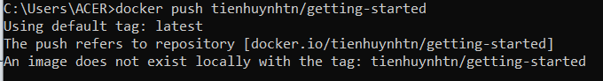

# Chương 6: Chia sẻ ứng dụng - Share the application

Bây giờ chúng ta đã built được một image, hãy chia sẻ nó với mọi người! Để chia sẻ Docker images, bạn cần sử dụng một [Docker registry](https://github.com/tienhuynh-tn/docker-basic-tutorial/blob/main/Chapter1.md#3-ki%E1%BA%BFn-tr%C3%BAc-docker---docker-architecture). Registry mặc định là Docker Hub.

**Note:** Docker ID cho phép bạn truy cập Docker Hub, nơi mà nó chính là thư viện và cộng đồng lớn nhất thế giới cho container images. Tạo một Docker ID miễn phí nếu bạn chưa có.

## Table of Contents
- [Create a repo - Tạo một kho](#create-a-repo---tạo-một-kho)
- [Push the image - Đẩy image](#push-the-image---đẩy-image)
- [Run the image on a new instance - Chạy image trên một instance mới](#run-the-image-on-a-new-instance---chạy-image-trên-một-instance-mới)
- [Recap - Tổng kết](#recap----tổng-kết)
- [Reference](#reference)
- [License & Copyright](#license--copyright)

## Create a repo - Tạo một kho

Để đẩy một image, đầu tiên chúng ta cần tạo một kho trên [Docker Hub](https://hub.docker.com/)

1. [Sign up](https://github.com/tienhuynh-tn/docker-basic-tutorial/blob/main/Chapter2.md#4-t%E1%BA%A1o-t%C3%A0i-kho%E1%BA%A3n-tr%C3%AAn-docker-hub) hoặc Sign in tới [Docker Hub](https://hub.docker.com/)
2. Tại thẻ [**Repositories**](https://hub.docker.com/repositories), tìm và nhấp chọn **Create Repository** nút để tạo một kho mới


4. Cho tên của kho, sử dụng tên `getting-started`. Hãy chắc chắn rằng sự hiển thị là **Public - Công khai**


**Note:** **Private repositories** - Bạn có biết rằng Docker hỗ trợ các kho riêng tư, cái mà cho phép bạn hạn chế nội dung với người dùng hoặc một nhóm cụ thể? Hãy kiểm tra chi tiết trong Docker pricing.

4. Nhấn nút **Create** để hoàn tất tạo kho

## Push the image - Đẩy image

1. Trong command line, hãy thử chạy câu lệnh push mà bạn thấy được sau khi tạo một kho mới trên Docker Hub. Chú ý rằng câu lệnh sẽ được sử dụng với namespace của bạn, không phải là "docker"


```
docker push docker/getting-started
```

**Note:** Khởi động Docker Desktop trước khi thực hiện chạy câu lệnh



Tại sao chạy câu lệnh không thành công? Câu lệnh push đã tìm kiếm một image tên tienhuynhtn/getting-started nhưng lại không tìm thấy. Nếu bạn thực hiện chạy câu lệnh `docker image ls`, bạn sẽ không thấy.


Để sửa lỗi này, chúng ta cần "tag - gắn thẻ" image hiện tại mà chúng ta đã built để cung cấp cho nó một cái tên khác

2. Đăng nhập vào Docker Hub sử dụng câu lệnh `docker login -u YOUR-USER-NAME`


**Note:** Sẽ có yêu cầu bạn nhập password của tài khoản Docker Hub

3. Sử dụng câu lệnh `docker tag` để tạo cho image `getting-started` một cái tên mới. Hãy chắc chắn rằng thay `YOUR-USER-NAME` với tên tài khoản Docker Hub của bạn

```
docker tag getting-started YOUR-USER-NAME/getting-started
```


4. Bây giờ thực hiện câu lệnh push ở bước 1 một lần nữa. Nếu bạn copy câu lệnh được gợi ý trong Docker Hub, bạn có thể bỏ phần `tagname` ở cuối câu lệnh, chúng ta không cần thêm tag cho tên của image. Nếu bạn không dùng một loại tag đặc biệt nào, Docker sẽ sử dụng tag tên `latest`

```
docker push YOUR-USER-NAME/getting-started
```


## Run the image on a new instance - Chạy image trên một instance mới 

Bây giờ image đã được built và được đẩy vào một registry, hãy thử chạy app trên một instance mới mà nó chưa bao giờ thấy container image này! Để làm được điều đó, chúng ta sẽ sử dụng Play with Docker.

1. Mở trình duyệt của bạn và đi đến [Play with Docker](https://labs.play-with-docker.com/)
2. Nhấn **Login** và sau đó chọn **docker** từ danh sách xổ xuống.


3. Kết nối với tài khoản Docker Hub của bạn


4. Nhấn **Start** để bắt đầu. Nhấn chọn **+ ADD NEW INSTANCE** ở thanh công cụ phía bên trái màn hình. Nếu bạn không tìm thấy nút đó, hãy mở rộng cửa sổ trình duyệt của bạn. Sau một vài giây, một cửa sổ terminal mở ra trong trình duyệt của bạn.


5. Trong terminal. chạy image đã được push khi nãy

```
docker run -dp 3000:3000 YOUR-USER-NAME/getting-started
```


Bạn sẽ thấy image được kéo xuống (pull) và khởi động tại port 3000!

6. Nhấn vào huy hiệu 3000 khi nó xuất hiện và bạn sẽ thấy ứng dụng chạy với phiên bản đã được sửa đổi tại bài hướng dẫn trước. Nếu huy hiệu 3000 không xuất hiện, bạn có thể nhấn chọn "Open Port" và gõ vào đó 3000

## Recap  - Tổng kết

Trong bài này, chúng ta đã học về cách làm thế nào để chia sẻ image bằng cách push chúng lên một kho. Chúng ta sau đó đã chạy image được đẩy trước đó. Điều này khá phổ biến trong CI, tạo image, push nó vào một registry và sau đó trong production environment có thể sử dụng phiên bản mới nhất của image.

Bây giờ chúng ta quay lại với ứng dụng todo list. Chúng ta cần chú ý việc khi khởi động lại app, chúng ta mất tất cả danh sách các việc cần làm. Điều này không phải là một trải nghiệm người dùng tốt, vì thế chúng ta sẽ học cách lưu trữ dữ liệu lại kể cả khi ứng dụng khởi động lại ở những bài học kế tiếp.

## Reference
- [Docker Documentation](https://docs.docker.com/get-started/)
- [Get started - Part 4: Share the application](https://docs.docker.com/get-started/04_sharing_app/)

## License & Copyright
&copy; 2022 Tien Huynh tienhuynh-tn Licensed under the [MIT LICENSE](https://github.com/tienhuynh-tn/docker-basic-tutorial/blob/main/LICENSE).

> :love_you_gesture: Feel free to use my repository and star it if you find something interesting :love_you_gesture:

