# Chương 7: Duy trì dữ liệu - Persist the DB

Có thể bạn không chú ý đến điều này, rằng danh sách những việc cần làm trong todo-list của chúng ta bị xóa sạch sẽ mỗi lần chúng ta khởi chạy container. Tại sao? Hãy đi sâu vào cách thức hoạt động của container để hiểu thêm về nó.

## Table of Contents
- [Hệ thống tập tin của container - The container’s filesystem](#hệ-thống-tập-tin-của-container---the-container's-filesystem)
  - [See this in practice](#see-this-in-practice)
- [Container volumes](#container-volumes)
- [Duy trì dữ liệu danh sách các việc cần làm - Persist the todo data](#duy-trì-dữ-liệu-danh-sách-các-việc-cần-làm---persist-the-todo-data)
- [Khám phá volume - Dive into the volume](#khám-phá-volume---dive-into-the-volume)
- [Recap - Tổng kết](#recap----tổng-kết)
- [Reference](#reference)
- [License & Copyright](#license--copyright)

## Hệ thống tập tin của container - The container’s filesystem

Khi một container chạy, nó sử dụng các lớp khác như từ một image cho hệ thống tập tin của nó. Mỗi container cũng có "scratch space" của riêng nó để tạo/cập nhật/xóa các file. Mọi thay đối sẽ không được nhìn thấy trong một container khác, ngay cả khi chúng đang sử dụng cùng một image.

### See this in practice

Để thấy được những điều trên trong thực tế, chúng ta sẽ khởi động 2 containers và tạo một file trong mỗi container đó. Cái mà bạn sẽ thấy được là các files được tạo trong một container không khả dụng trong container còn lại.

1. Khởi động một container `ubuntu` cái mà sẽ tạo ra một file có tên `/data.txt` với một con số random giữa 1 và 10 000.

```
docker run -d ubuntu bash -c "shuf -i 1-10000 -n 1 -o /data.txt && tail -f /dev/null"
```

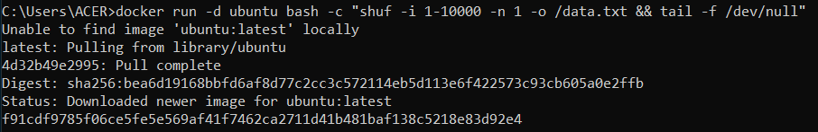

Trong trường hợp bạn tò mò về câu lệnh, chúng ta khởi động một bash shell và gọi hai lệnh (lý do chúng ta có `&&`). Phần đầu tiên chọn một số ngẫu nhiên và viết nó vào `/data.txt`. Dòng lệnh thứ hai chỉ đơn giản là xem một tệp để giữ cho container chạy.

2. Để nhìn thấy được giá trị số đã tạo trong file data.txt, ta mở Dashboard và nhấp chọn hành động đầu tiên (CLI) của container đang chạy image Ubuntu

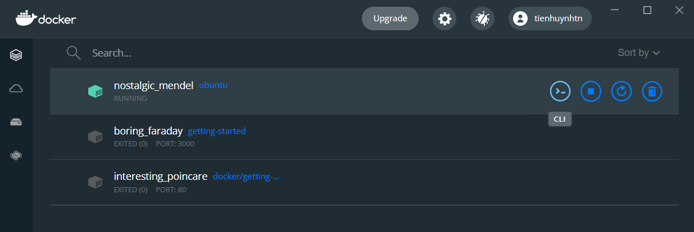

Bạn sẽ thấy một terminal đang chạy trong ubuntu container. Chạy dòng lệnh dưỡi đây để thấy được nội dung file `/data.txt`. Đóng terminal sau khi thực hiện xong dòng lệnh.

```
cat /data.txt
```

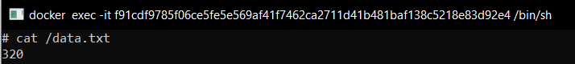

Hoặc nếu bạn thích dùng dòng lệnh tại command line, bạn có thể sử dụng `docker exec` để thực hiện câu lệnh. Bạn cần có được container's ID (sử dụng câu lệnh `docker ps` để có được ID) và nhận được nội dung của file thông qua câu lệnh dưới đây

```
docker exec <container-id> cat /data.txt
```

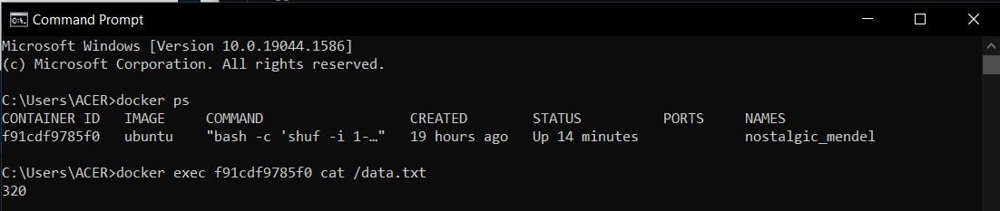

3. Bây giờ, hãy khởi động một container `ubuntu` khác (cùng một image) và bạn sẽ thấy chúng ta không có cùng một file

```
docker run -it ubuntu ls /
```

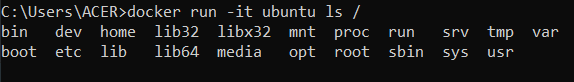

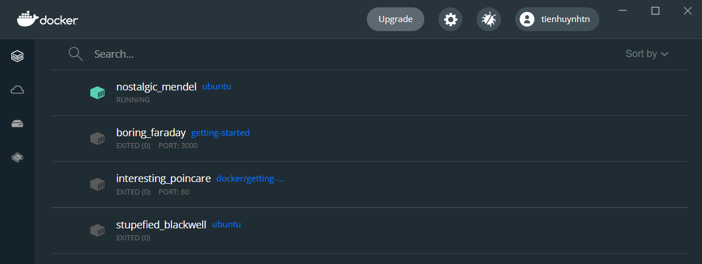

Và hãy nhìn đi! Không có file `data.txt`! Đó bởi vì nó được viết vào scratch space cho container đầu tiên.

4. Tiếp theo hãy gỡ bỏ container đầu tiên bằng dòng lệnh `docker rm -f <container-id>`

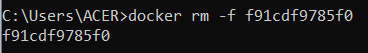

## Container volumes

Với thử nghiệm trước đó, chúng ta đã thấy rằng mỗi container bắt đầu từ image định nghĩa (image definition) mỗi khi nó khởi động. Trong khi những container có thể tạo, cập nhật và xóa các file, những sự thay đổi này mất khi container bị loại bỏ (remove) và tất cả những sự thay đổi này sẽ "cách ly" (isolated) với container đó. Với volumes, chúng ta có thể thay đổi tất cả điều đó.

[Volumes](https://docs.docker.com/storage/volumes/) cung cấp khả năng để kết nối với các đường dẫn hệ thống tệp cụ thể của container trở lại máy chủ (host machine). Nếu một thư mục trong container được gắn (mounted), các thay đổi trong thư mục đó cũng được nhìn thấy trên máy chủ. Nếu chúng ta gắn kết cùng một thư mục trên container khởi động lại, chúng ta sẽ thấy các tệp tương tự.

Có 2 loại volumn chúng. Chúng ta sẽ lần lượt sử dụng cả hai, nhưng chúng ta sẽ bắt đầu với volume đã được đặt tên.

## Duy trì dữ liệu danh sách các việc cần làm - Persist the todo data

Mặc định, ứng dụng quản lí việc cần làm lưu trữ dữ liệu của nó trong [SQLite Database](https://www.sqlite.org/index.html) tại `/etc/todos/todo.db` trong hệ thống file của container. Nếu bạn không quen với SQLite, đừng lo lắng! Nó đơn giản là một cơ sở dữ liệu quan hệ mà trong đó tất cả dữ liệu được lưu trữ trong một file duy nhất (single file). Mặc dù đây không phải là tốt nhất cho các ứng dụng quy mô lớn, nó hoạt động cho các bản demo nhỏ. Chúng ta sẽ nói về việc chuyển đổi điều này sang một công cụ cơ sở dữ liệu khác sau đó.

Với cơ sở dữ liệu là một file duy nhất, chúng ta có thể duy trì file trên máy chủ và làm nó có thể dùng được ở container kế. Bằng cách tạo ra một volume và đính kèm - attaching (thường được gọi là "gắn" - "mounting") nó vào thư mục mà dữ liệu được lưu trữ trong đó, chúng ta có thể duy trì dữ liệu. Khi container của chúng ta ghi vào tệp `todo.db`, nó sẽ được duy trì với máy chủ trong volume

Như đã được đề cập, chúng ta sẽ sử dụng một volume đã được đặt tên. Docker duy trì vị trí vật lý trên đĩa và bạn chỉ cần nhớ tên của volume. Mỗi khi bạn sử dụng volume, docker sẽ đảm bảo dữ liệu chính xác được cung cấp.

1. Tạo một volume bằng cách sử dụng câu lệnh `docker volume create`

```
docker volume create todo-db
```

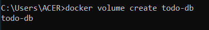

2. Dừng và loại bỏ container todo app một lần nữa trong Dashboard (hoặc dùng câu lệnh `docker rm -f <id>`), vì nó vẫn đang chạy mà không sử dụng duy trì volume

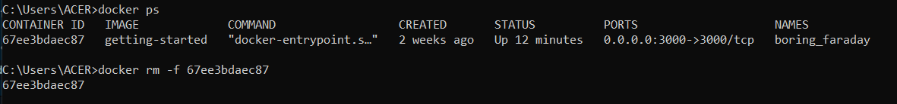

3. Khởi động container todo app, nhưng thêm cờ `-v` để chỉ định volume. Chúng ta sẽ sử dụng volume đã được đặt tên (todo-db) và gắn nó vào `/etc/todos`

```
docker run -dp 3000:3000 -v todo-db:/etc/todos getting-started
```


4. Một lần nữa khởi động container, mở ứng dụng và thêm một vài việc cần làm vào danh sách

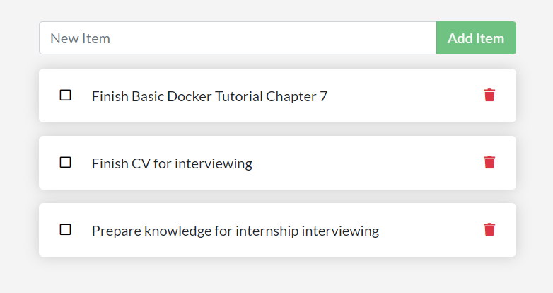

5. Dừng và gỡ bỏ container của ứng dụng todo. Sử dụng Dashboard hoặc `docker ps` để lấy ID và sau đó `docker rm -f <id>` để loại bỏ nó

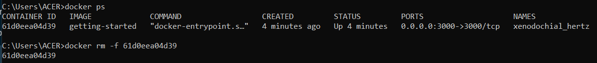

6. Bắt đầu một container mới và sử dụng cùng một câu lệnh như trên

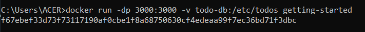

7. Mở ứng dụng. Bạn sẽ thấy các việc cần làm mà bạn tạo khi nãy vẫn còn!

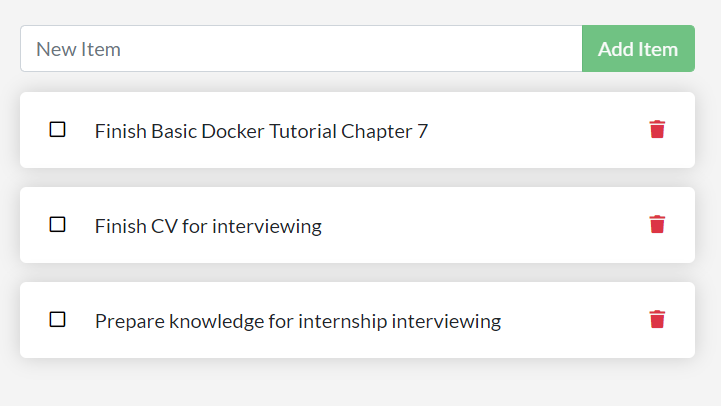

8. Tiếp tục và loại bỏ container khi bạn hoàn thành những việc cần làm trong danh sách

Như vậy bạn đã học được cách duy trì dữ liệu!

## Khám phá volume - Dive into the volume

Rất nhiều người thường hay hỏi "Docker đang thực sự lưu trữ dữ liệu của tôi khi tôi sử dụng một volume?" Nếu bạn muốn biết, bạn có thể sử dụng câu lệnh `docker volume inspect`

```
docker volume inspect todo-db
```

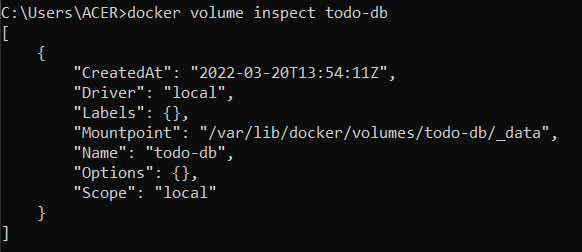

`Mountpoint` là vị trí thực tế trên đĩa nơi lưu trữ dữ liệu.

**Note:** Trong khi chạy trong Docker Desktop, các lệnh docker thực sự đang chạy bên trong một VM nhỏ trên máy của bạn. Nếu bạn muốn xem nội dung thực tế của thư mục Mountpoint, trước tiên bạn cần phải vào bên trong VM.

## Recap  - Tổng kết

Tại thời điểm hiện tại, chúng ta đã hoàn tất việc duy trì dữ liệu của ứng dụng.

## Reference
- [Docker Documentation](https://docs.docker.com/get-started/)
- [Get started - Part 5: Persist the DB](https://docs.docker.com/get-started/05_persisting_data/)

## License & Copyright
&copy; 2022 Tien Huynh tienhuynh-tn Licensed under the [MIT LICENSE](https://github.com/tienhuynh-tn/docker-basic-tutorial/blob/main/LICENSE).

> :love_you_gesture: Feel free to use my repository and star it if you find something interesting :love_you_gesture:

